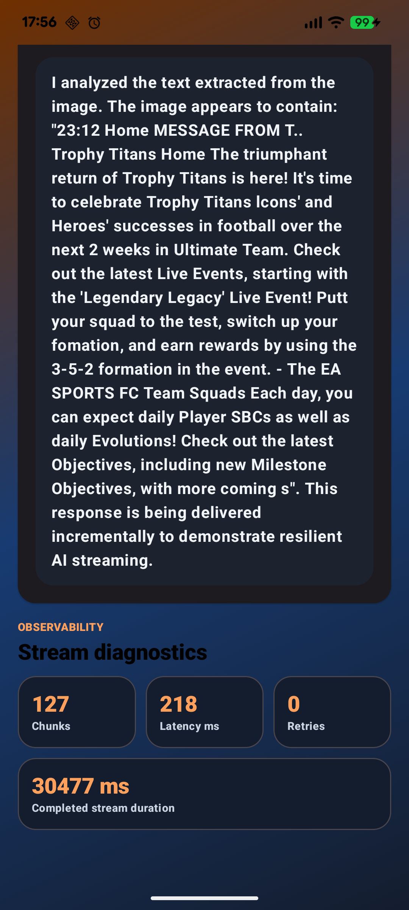
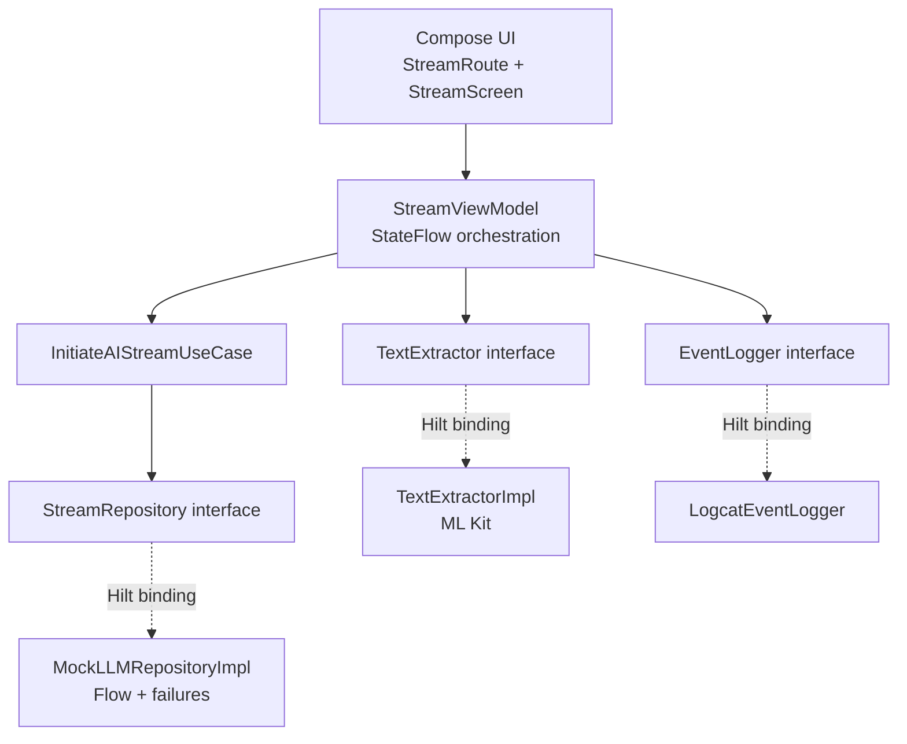

# Resilient AI Streamer — V1

A production-style Android portfolio project demonstrating on-device text recognition, incremental AI response streaming, partial-output preservation, retry-from-failure, and observable latency metrics.

> **Project status:** V1 complete. This version delivers the full local image-to-resilient-stream workflow within a focused time.

### V1 scope

- On-device OCR with Google ML Kit
- Mocked AI response streaming with Kotlin Flow
- Deliberate latency spikes and attempt-level failures
- Partial-response preservation
- Resume from the failed chunk index
- Structured Logcat observability
- Compose diagnostics and deterministic recovery testing

## Demo

<p align="center">
  
</p>

<p align="center">
  <a href="docs/media/full-demo.mov">Watch the full-quality demo</a>
</p>


## Objective

Resilient AI Streamer turns an image into a streamed, mocked AI response while deliberately introducing realistic failure conditions.

The user can:

1. Select an image with Android Photo Picker.
2. Extract its text locally with Google ML Kit.
3. Start an incremental AI-style response.
4. Watch response chunks arrive through Kotlin Flow.
5. Preserve useful output when the stream is interrupted.
6. Resume from the exact failed chunk instead of restarting.
7. Inspect latency, chunk, retry, and completion diagnostics.

## Why This Project Exists

AI responses are naturally exposed to variable latency, interrupted connections, process recreation, backend errors, and incomplete output. A resilient client should not discard useful content simply because a stream failed before completion.

This project treats partial output as recoverable state. Failure is visible, measurable, and actionable rather than represented as a generic error screen.

The result is a focused demonstration of the Android engineering concerns surrounding an AI feature—not merely a text-generation mock.

## Demo Flow

```text
Select image
    ↓
On-device OCR
    ↓
Create stable response chunks
    ↓
Stream chunks with simulated latency
    ↓
Complete successfully ────────────────┐
    │                                 │
    └─ or interrupt at chunk N        │
              ↓                       │
       Preserve partial output        │
              ↓                       │
       Resume from chunk N ───────────┘
```

## Technology

- Kotlin
- Jetpack Compose and Material 3
- MVVM
- Hilt dependency injection
- Kotlin Coroutines, Flow, and StateFlow
- Google ML Kit Text Recognition
- Android Photo Picker
- Logcat event logging
- JUnit and `kotlinx-coroutines-test`

## Architecture

The project uses one application module with package-level separation. This keeps the sprint practical while preserving clean dependency boundaries.



### Package structure

```text
com.paulmathew.resilientaistreamer
├── data
│   ├── logging
│   │   └── LogcatEventLogger.kt
│   ├── ml
│   │   └── TextExtractorImpl.kt
│   └── stream
│       └── MockLLMRepositoryImpl.kt
├── di
│   └── AppModule.kt
├── domain
│   ├── model
│   ├── repository
│   └── usecase
├── ui
│   ├── StreamRoute.kt
│   ├── StreamUiState.kt
│   └── StreamViewModel.kt
├── MainActivity.kt
└── ResilientAIStreamerApplication.kt
```

### Dependency direction

```text
UI → Domain ← Data
```

- Domain models and repository contracts have no Android framework imports.
- The UI does not know about `Bitmap`, `InputImage`, `TextRecognizer`, or ML Kit internals.
- Business logic depends on interfaces.
- Hilt selects concrete implementations at the application boundary.

## On-Device ML

V1 uses Google ML Kit Text Recognition with its bundled Latin-script model. Recognition happens on the device, avoiding a network round trip and keeping the selected image local to the application flow.

The domain layer represents an image as:

```kotlin
data class ImageInput(
    val uriString: String,
    val displayName: String? = null,
)
```

Android `Uri`, ML Kit `InputImage`, `TextRecognition`, and `TextRecognizerOptions` are reconstructed only inside `TextExtractorImpl`.

ML Kit imports are intentionally restricted to:

```text
data/ml/TextExtractorImpl.kt
```

This keeps the ML implementation replaceable and prevents framework-specific image objects from entering UI state.

## Streaming with Kotlin Flow

`MockLLMRepositoryImpl` exposes:

```kotlin
fun streamResponse(
    extractedText: String,
    resumeFromChunkIndex: Int = 0,
): Flow<StreamResult>
```

The repository:

- Normalizes OCR whitespace.
- Limits included OCR input to 600 characters.
- Builds a deterministic mock response.
- Splits the response into stable word-like chunks.
- Suspends between emissions to simulate network latency.
- Measures latency for each emitted chunk.
- Emits a final completion result containing total chunks and duration.

The same extracted text always creates the same ordered chunk list. Stable indexes are what make retry-from-failure safe.

## Failure and Latency Simulation

Each stream attempt has an approximately 30% chance of interruption. Failure is selected once per attempt rather than once per chunk; otherwise, longer responses would become almost guaranteed to fail.

Most chunks are delayed by approximately 80–240 ms. Ten percent receive a simulated latency spike of approximately 700–1,200 ms.

These conditions make resilience and observability visible during a local demo without requiring an unreliable external backend.

## Partial-Output Preservation

When the repository reaches its selected failure point, it throws:

```kotlin
StreamInterruptedException(
    failedAtChunkIndex = index,
    recoveredText = deliveredPrefix,
)
```

The failed chunk is not emitted. `recoveredText` contains all successfully delivered chunks before it.

For example:

```text
Chunk indexes:   0   1   2   3   4
Delivered:       ✓   ✓   ✓
Failure:                     ×
Resume index:                3
```

`StreamViewModel` catches this specific exception, preserves the recovered response, stores the failed index, and exposes a Resume action. Retry begins at index 3, so chunks 0–2 are neither requested nor appended again.

## UI State and Lifecycle

`StreamUiState` is the single observable state for the screen. It contains:

- Selected image metadata
- Extracted text
- Partial or completed streamed response
- Extraction and streaming progress
- Retry availability and failed chunk index
- Warning and error messages
- Chunk count
- Last-chunk latency
- Retry count
- Completed stream duration

`StreamViewModel` exposes this state as read-only `StateFlow`. Compose collects it with lifecycle awareness and redraws as chunks arrive.

When another image is selected, the previous processing job is cancelled. `CancellationException` is rethrown rather than converted into a user-facing error, preserving structured coroutine cancellation.

## Visual Design

The interface presents the workflow as three visible stages: Select, Extract, and Stream.

The visual system uses:

- Orange for primary actions and active processing
- Blue for OCR and supporting information
- Red for interruptions and errors
- High-contrast surfaces for streamed and extracted text

The screen intentionally prioritizes workflow clarity over decorative complexity. Diagnostics remain visible without competing with the main response.

## Observability

`EventLogger` keeps instrumentation independent from Android logging APIs. `LogcatEventLogger` records events with the tag:

```text
ResilientAIStreamer
```

Recorded events include:

| Event | Purpose |
|---|---|
| `IMAGE_SELECTED` | Records image selection |
| `TEXT_EXTRACTION_STARTED` | Marks OCR start |
| `TEXT_EXTRACTION_COMPLETED` | Records OCR latency, blocks, and characters |
| `STREAM_STARTED` | Records initial or resumed stream index |
| `STREAM_CHUNK_RECEIVED` | Records chunk index and latency |
| `STREAM_LATENCY_SPIKE` | Highlights unusually slow chunks |
| `STREAM_INTERRUPTED` | Records failed index and recovered characters |
| `STREAM_RETRY_STARTED` | Records resume index and retry count |
| `STREAM_COMPLETED` | Records chunks, duration, and retries |

Interruption and latency-spike events use warning-level Logcat entries; normal lifecycle events use debug-level entries.

## Memory and Performance Considerations

The implementation makes several deliberate choices:

- URI-based image input avoids carrying large bitmaps through domain and UI state.
- ML Kit processing is awaited through a cancellable coroutine.
- Potential image loading work is dispatched away from the main thread.
- Flow delays suspend without blocking threads.
- OCR text included in the mock response is bounded to 600 characters.
- The ViewModel keeps one state source for Compose.
- Active processing is cancelled when the input changes.
- UI collection is lifecycle-aware.

For significantly larger production responses, repeated string concatenation would be replaced with a chunk collection or bounded buffer to reduce allocations.

## LiteRT-Ready Design

The application does not directly depend on TensorFlow, TensorFlow Lite, or LiteRT in V1.

ML Kit was selected because it provides reliable on-device OCR within the 20-hour delivery constraint. Text recognition remains hidden behind:

```kotlin
interface TextExtractor {
    suspend fun extractText(
        input: ImageInput,
    ): TextExtractionResult
}
```

A future `LiteRtTextExtractorImpl` could replace `TextExtractorImpl` without changing domain models, streaming logic, the ViewModel, or Compose UI.

LiteRT is Google's current on-device runtime and successor to TensorFlow Lite. A meaningful migration would require selecting a suitable OCR model and implementing its image preprocessing, tensor I/O, and output decoding—not merely adding a runtime dependency.

## Testing

The ViewModel test uses deterministic fakes instead of the random production repository.

It verifies that:

1. OCR completes.
2. A response chunk is delivered.
3. The stream is interrupted.
4. Partial text remains visible.
5. Retry begins at the failed index.
6. The completed response contains no duplicate chunks.
7. Retry and completion events are logged.

Run local tests with:

```bash
./gradlew testDebugUnitTest
```

Build the debug application with:

```bash
./gradlew assembleDebug
```

Or run both checks:

```bash
./gradlew testDebugUnitTest clean assembleDebug
```

## Running the App

1. Clone the repository.
2. Open it in Android Studio.
3. Allow Gradle synchronization to complete.
4. Run the `app` configuration on an emulator or Android device.
5. Select an image containing readable text.
6. Tap **Analyze**.
7. Repeat if necessary to observe the randomized interruption path.
8. When interrupted, tap **Resume from failure point**.

No API key or remote backend is required.

## How It Addresses AI Android Requirements

| Requirement | Implementation |
|---|---|
| AI-agent UX | Progressive response with visible recovery controls |
| On-device ML | ML Kit Text Recognition |
| TensorFlow/ML exposure | Replaceable ML boundary and LiteRT-ready design |
| Streaming responses | Kotlin Flow chunk emission |
| Retry logic | Resume from a stable failed chunk index |
| Partial output | Recovered text remains in StateFlow |
| Latency handling | Per-chunk metrics and deliberate spikes |
| Coroutine knowledge | Cancellable suspend work and Flow collection |
| Memory awareness | URI boundary and bounded OCR response input |
| Observability | Structured Logcat event stream |
| Architecture | Pure domain contracts with Hilt bindings |
| Testing | Deterministic ViewModel recovery test |


## Deliberate constraints include:

Short Sprint Constraints
This project intentionally favors a complete, explainable vertical slice over maximum scope.

- One Gradle application module
- Package-level clean architecture
- One primary Compose screen
- Mocked LLM output instead of a remote backend
- Logcat observability instead of a telemetry SDK
- ML Kit instead of a custom OCR model
- Practical abstractions only at meaningful replacement or test boundaries

These choices preserve time for the project's core engineering story: streaming state, latency awareness, interruption recovery, and production-readable Android architecture.

## Next Steps 

- Replace the mock stream with an HTTP, SSE, or WebSocket LLM backend.
- Add idempotent server-issued resume tokens.
- Persist recoverable stream state with `SavedStateHandle`.
- Add bounded retries with exponential backoff and jitter.
- Distinguish retryable, non-retryable, and authentication failures.
- Add network connectivity monitoring.
- Add Compose UI and instrumentation tests.
- Add structured analytics, traces, and privacy-aware diagnostics.
- Benchmark memory behavior with large images and long responses.
- Replace repeated response concatenation with a scalable buffer.
- Evaluate a suitable LiteRT OCR model.
- Add accessibility, localization, and large-screen review.
- Add screenshot and baseline-profile testing in CI.

## Engineering Summary

Resilient AI Streamer demonstrates that an Android AI feature is more than a model call. It is a stateful user experience that must remain responsive, observable, cancellable, and recoverable when real-world conditions are imperfect.
